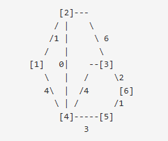

# 택배배송 - 5972

[문제 링크](https://www.acmicpc.net/problem/5972)

`#그래프 이론` `#최단 경로` `#다익스트라` `#O(N)`

---

### 문제
농부 현서는 농부 찬홍이에게 택배를 배달해줘야 합니다. 그리고 지금, 갈 준비를 하고 있습니다. 평화롭게 가려면 가는 길에 만나는 모든 소들에게 맛있는 여물을 줘야 합니다. 물론 현서는 구두쇠라서 최소한의 소들을 만나면서 지나가고 싶습니다.

농부 현서에게는 지도가 있습니다. N (1 <= N <= 50,000) 개의 헛간과, 소들의 길인 M (1 <= M <= 50,000) 개의 양방향 길이 그려져 있고, 각각의 길은 C_i (0 <= C_i <= 1,000) 마리의 소가 있습니다. 소들의 길은 두 개의 떨어진 헛간인 A_i 와 B_i (1 <= A_i <= N; 1 <= B_i <= N; A_i != B_i)를 잇습니다. 두 개의 헛간은 하나 이상의 길로 연결되어 있을 수도 있습니다. 농부 현서는 헛간 1에 있고 농부 찬홍이는 헛간 N에 있습니다.

다음 지도를 참고하세요.

농부 현서가 선택할 수 있는 최선의 통로는 1 -> 2 -> 4 -> 5 -> 6 입니다. 왜냐하면 여물의 총합이 1 + 0 + 3 + 1 = 5 이기 때문입니다.

농부 현서의 지도가 주어지고, 지나가는 길에 소를 만나면 줘야할 여물의 비용이 주어질 때 최소 여물은 얼마일까요? 농부 현서는 가는 길의 길이는 고려하지 않습니다.

### 입력
첫째 줄에 N과 M이 공백을 사이에 두고 주어집니다.

둘째 줄부터 M+1번째 줄까지 세 개의 정수 A_i, B_i, C_i가 주어집니다.

### 출력
첫째 줄에 농부 현서가 가져가야 될 최소 여물을 출력합니다.

### 핵심 풀이 전략

`메모리: 52884 KB`
`시간: 476 ms`

---

### 삽질 기록 🧠

- **잘못된 우선 순위 큐 사용**
    - a -> a[0]으로 단순히 헛간의 번호만 비교함
- **중복 방지 로직 누락**
  - if (curCost > dist[curIndex]) continue; 코드 누락

---

### 배운 점 & 보완할 점
- 우선 순위 큐에서 Comparator 사용법을 좀 더 공부할 필요가 있음.
- **중복 방지**를 위한 로직이 항상 들어가야함을 잊지 말자